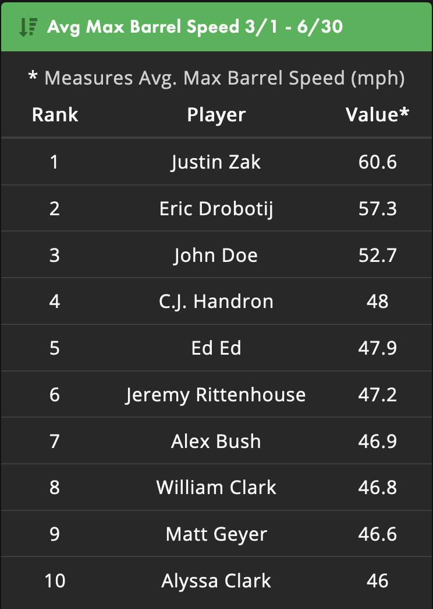
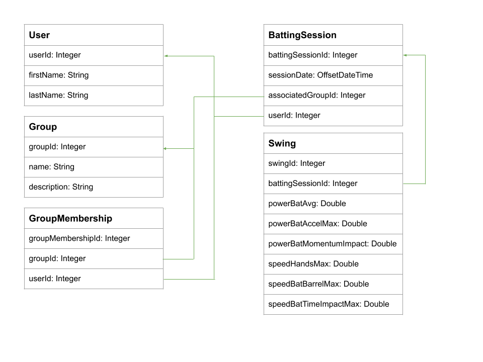

# Leaderboard Coding Challenge
## Background

The Diamond Kinetics Java API utilizes swing data in order to produce leaderboards that clients can configure and create
in order to display results in various use cases.

The type of information we display on a leaderboard would contain an aggregate value such as the swing count, swing
metric total, swing metric average, or the swing metric maximum. This aggregate value would be displayed along with
the rank as well as the user's first and last name. See the image below to get an idea of what a leaderboard would look
like:

These leaderboards are created and displayed within the context of a Group (a collection of users who are members), and
only use swing data from group members. The following diagram below depicts the relationships between data
models that will need to be utilized when implemented logic around Leaderboard functionality.

These models are already in the project under the package `com.diamondkinetics.codingchallenge.leaderboard.model`,
please use them in your implementation. Blank LeaderboardConfig and LeaderboardResult model classes have been provided
in the package as well. The properties in the Swing model that begin with `metric` are swing metrics
that are derived from our sensor data, an Enum for human readable names has been provided at
`com.diamondkinetics.codingchallenge.leaderboard.model.enums.SwingMetric`.

## Instructions

Given the above, add any properties and methods to the LeaderboardConfig and LeaderboardResult model classes that you
think would allow for the creation and display of Leaderboards within the context of a Group. Add any other necessary
classes (service classes, helper classes, database/data access classes, etc) and their business logic you may need
to use in order to facilitate creating Leaderbards and displaying their results. Include any unit tests you feel may be
necessary as well.